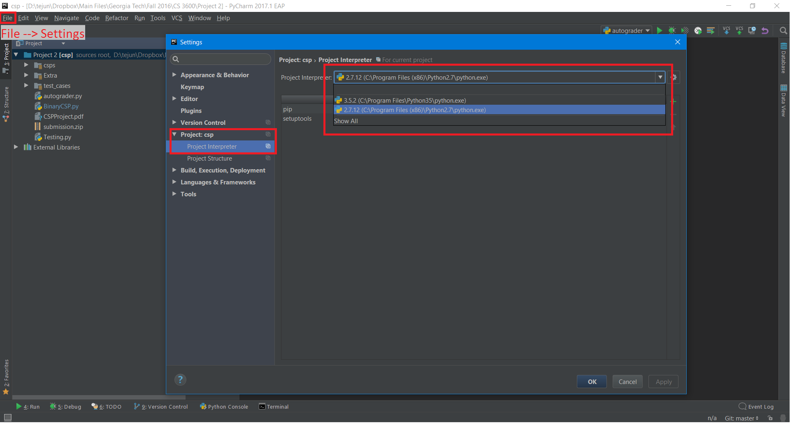
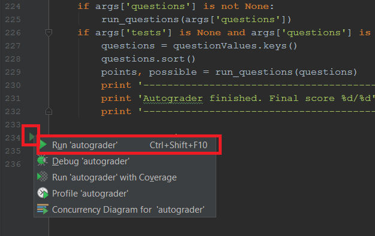
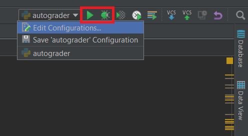
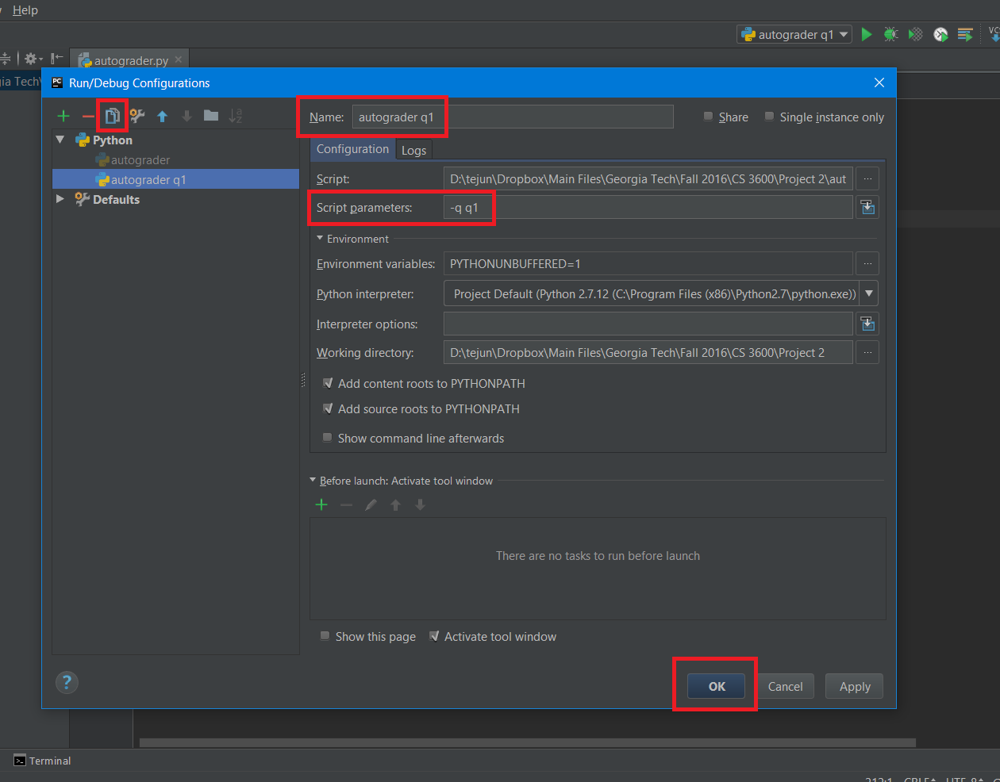
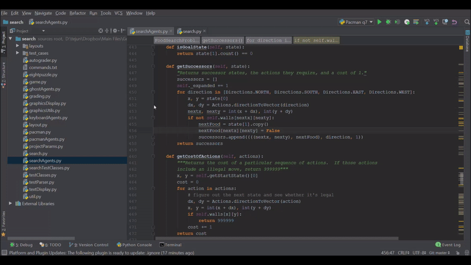

# Debugging with PyCharm

We (Georgia Tech's CS 3600 TAs) made this tutorial to introduce **PyCharm** to students taking the course. Two main reasons for using PyCharm over a text editor:

* Dynamic error checking and warning messages
* A built-in debugger

We will go over the debugger towards the end of the tutorial. If you already have PyCharm set up and working, you can skip right to that part.

This tutorial assumes students have used **IntelliJ IDEA** in CS 1332. Students who have not used IntelliJ should be able to follow along, but it might take time to get used to the GUI and keyboard shortcuts.

Note: Some of the pictures may look a _little_ different, we use an Early Access Preview version of PyCharm.

## Downloading PyCharm

**JetBrains** is a company that creates development tools for programmers. A full list of IDEs and tools can be found [here](https://www.jetbrains.com/products.html?fromMenu). For our course, we will be using their Python IDE called **PyCharm**.

You can download PyCharm [here](https://www.jetbrains.com/pycharm/download/#section=windows). There are two different versions:

* **Community**: Free for everyone to use and has all the features needed for our course. _We recommend this version._
* **Professional**: Developed for corporations, has lots of enterprise-level features. Requires a license.

### Get a Student Account (Optional)

JetBrains offers all their professional tools for free to students! You can create a student account [here](https://www.jetbrains.com/student/). We won't go into much more detail on this, as this is not a required step.

## Initial Setup

After downloading and installing PyCharm, run the application. You will have to choose a few options for the initial setup, but this should only take a few seconds. 

We recommend that you stick to all the default settings. However, feel free to change the theme: `Dracula` looks similar to **Atom** and **Sublime Text**.

## Opening Projects in PyCharm

This is pretty self explanatory. Make sure the project folder is downloaded and you know where it is.

Click on the `Open` button in the welcome screen, select the project folder in the navigation view, and click `Ok`.

## Setting the Python Environment

Usually, PyCharm is able to find your default Python installation path. However, if your laptop is set up incorrectly, you will need to explicitly specify the path. Follow these steps to check:

1. `File` -> `Settings`
2. Select `Project` -> `Project Interpreter` on the left of the settings menu
3. Make sure `Python 2.7.*` is selected in the dropdown menu (the * can be any number)



If you see python in the dropdown menu, you can skip to the next section. Otherwise:

1. Select `Show All` in the dropdown menu.
2. Click on the green plus button.
3. Add the directory to `python.exe`. Depending on your operating system, you might have to Google where you can find the executable on your computer. For Windows users, it's in the Python2.7 folder either in `C:/Program Files` or `C:/Program Files (x86)`.

## Running the Autograder

Instead of using the terminal to run the autograder, we will create a `Run Configuration`. With this, you will be able to re-run the command (and later use the debugger) without having to re-type the entire command.

### Running `python autograder.py`

We wish to run the autograder with no extra parameters (no `-q q1`). Here is how we can do that:

1. Open `autograder.py` by double-clicking on it on the `Project Menu` toward the left
2. Scroll down until you see:

```python
if __name__ == "__main__":
```
Click the green run button to left, then press `Run`. This will run the autograder, which is the equivalent of typing in `python autograder.py` into the terminal.



Notice how this has created a `Run Configuration` on the top left. Any files you run will show up in this dropdown menu. To re-run any of these, you can select it in the menu and press on the green arrow to the right.



### Running the autograder with parameters

We can edit the `Run Configuration` to pass in parameters to the autograder. For example, we can run `python pacman.py -q q1` with the following:

1. Click on the dropdown menu in the top right, select `Edit Configurations`
2. In the pop-up menu, select the `autograder` run configuration from before. Click on the `Copy` button on the top (should be to the right of a red minus).
3. We have now made a copy of the run configuration that we can change. In the `Name` field, type in something descriptive, like "autograder q1".
4. In the `script parameters` field, type in the parameters like "-q q1".
5. Press `Ok`



Now when you run "autograder q1", it will run the script with the specified parameters.

### Running other files

This same method can be extended to run other files. For example, to run `python pacman.py -l mediumMaze -p SearchAgent -a fn=bfs`, just make a new run configuration for "pacman.py" with script parameters "-l mediumMaze -p SearchAgent -a fn=bfs".

## Using the Debugger

The main reason we recommend PyCharm is for the debugger! Before continuing, double check that you understand the **Running the Autograder** section above. You will need the autograder `Run Configuration` to run the debugger.

Well, you might be wondering what the debugger is. Basically, it is a tool that lets you set specific `Breakpoints` where your program will **pause execution**. Everytime the program pauses, you can:

* Check the values assigned to all your variables
* Step into function calls and check what they return
* Make changes to the code while still "running" the program
* And a lot more...

### Setting breakpoints

To use the debugger, we need to set `Breakpoints`, which are lines of code where the program will pause execution _every time_ it hits that line. To set a breakpoint, single-click on the bar to the right of the line numbers. This creates a red circle, which is a breakpoint. Later, you can click on it again to remove it.



### Running the debugger

Go ahead and click on the debug button (to the right of the run button at the top). Make sure you selected a `Run Configuration` that will actually get to that line of code, such as the autograder. 

As you can see in the gif, the program paused at that line. The line of code has not been executed yet, and you can view all the variables currently assigned before executing the line. Note that objects are nested, so you can expand  each object to see what attributes it has. 

_This is extremely useful for debugging, certainly better than printing out all your variables!_

### Code navigation

We can do much more than just pause at a specific line. Here are some more useful features of the debugger:

#### Resume program execution

After pausing the program at a breakpoint, you can have it continue like normal until it reaches another breakpoint. This breakpoint could be the same one being called in a loop, or a completely different one.

#### Step over

Runs the next line of code in the program and then pauses again. It will just go line by line. Note that if you have any function calls, it won't go into the function call stack.

#### Step into

Runs the next line of code in a function call. Basically, it will step into any function that you are currently paused at, unlike **step over**.

#### Stop

Of course, make sure to hit the stop button after you're done with the debugger.

We'll let you play around with the debugger on your code. Try it out!

## Other Protips (Optional)

### Debugger Performance

Don't run your code in debugger mode if you aren't actually debugging. It's a lot slower.

### Line Numbers

To show line numbers, right-click on the bar where you set debug breakpoints, then select the `show line numbers` option.

### Version Control Integration

PyCharm has **git** and **GitHub** integration built right into it. You can find out more about it [here](https://www.jetbrains.com/help/pycharm/2016.3/registering-github-account-in-pycharm.html). No more complaining that your laptop crashed and you lost all your work please...

Of course, we don't want you guys sharing code over GitHub, so please make them private repos (it is cheating to make them public, our cheat detector will catch it). You can set up the repoistory on [Gatech's GitHub](http://www.github.gatech.edu), as that comes with unlimited free private repos. 

Super secret tip: You can get unlimited free private repos on the [regular GitHub site](http://www.github.com) if you are a student (normally it costs $7 / month for 5 private repos). You need to sign up for a [GitHub Student Account](https://education.github.com/pack). It comes with a bunch of other free products not needed, such as AWS credit, custom domain names, continuous integration build hours, cloud-based solutions, etc.
